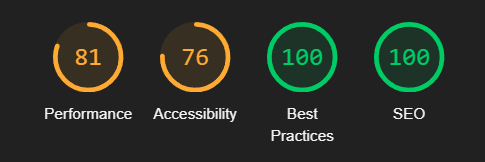
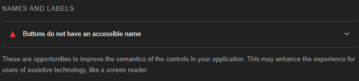

# Mental

This work is part of my thesis on creating a messaging application with sentiment analysis capabilities. It combines several technologies to create a secure and visually appealing messaging app that utilizes machine learning capabilities. This was achieved through a lot of research, time and hard work, having created both the front-end, back-end, machine learning model, a secure encryption, as well as every API connection.

# Abstract

This work presents the development and implementation of a messaging application that incorporates real-time sentiment analysis to enhance emotional understanding in digital communication. The application addresses the challenges that many individuals face in expressing and interpreting emotions in text-based conversations, with particular benefit for individuals on the autism spectrum who often struggle with recognizing emotional context. The paper presents a comprehensive solution that combines modern web application development technologies, end-to-end encryption, and machine learning for the analysis and visualization of emotions. The result is a Progressive Web App (PWA) that can be installed on any modern mobile device, regardless of operating system, offering secure communication with an enriched emotional dimension.

# Application features

The main idea is centered around helping people understand eachother and communicate better. To achieve this, the application has several features integrated within it, guiding the user into a friendly and easy to navigate experience.

## Converting feelings

With the use of a custom-made neural network and an overall utilization of artificial intelligence, the application attempts to convert each text sent into an emotionally understandable spectrum of colors.

When sending messages through the application, the message contents are analyzed in real time and attempt to classify them into twenty seven different emotions which are then matched into colors. In the chatroom interface the background changes based on the emotion predictions. When a user scrolls through the application, the colors change to match the last message visible at that moment.

>  > Image: Chat view of the application

After creating and initiating a conversation with someone, the user can see in their home screen a new background that expands and changes colors as the conversations add up and their emotions change.

## Analyzing understanding

Each conversation has their own analytics desplayed in a separate dashboard. When a user navigates to a conversation, they can select the dashboard button which redirects them to that interface. There, they can view that conversation's analytics, showing the emotions throughout the month or year and even view some statistics for each emotion separately.

>  > Image: Dashboard and chat view of the application

# Styling

For styling, a popular component library is used called [Material UI](https://mui.com/material-ui/), an open-source React component library that implements Google's Material Design. It's comprehensive and can be used in production out of the box.

The main advantage of using Material UI is a faster developing time and keeping the focus on business logic instead of styling and formatting. The library also includes an extensive set of intuitive customizability features as well as templates to speed up the development even more, however for this project no template will be used.

Material UI provides a plethora of pre-built components for use. Once Installed, a component can easily be used by importing it and inserting a simple tag.

Imported components can be as simple or a complex as the user needs. MUI provides the ability to customize them by adding several different props that alter them in many ways depending on the component. A list of such components can be found [here](https://mui.com/material-ui/all-components/)

> 
> Image: Emotion color palettes

# Hosting

The application is designed for modern web deployment with progressive web app (PWA) capabilities, allowing installation on mobile devices. This approach provides the advantages of both web accessibility and native-like functionality.

The deployment is managed using Vercel, a platform specialized in hosting JavaScript applications. This configuration ensures proper routing for the single-page application architecture, directing all requests to the main entry point where the React Router handles internal navigation.

# End-to-end encryption (E2EE)

Secure communication is a big concern in modern messaging applications. To address this need, the system implements a robust end-to-end encryption (E2EE) protocol that ensures message confidentiality between participants.

The system uses a hybrid encryption model that combines the advantages of both asymmetric and symmetric encryption. This approach maximizes both security and performance.

Initial key exchanges are carried out using RSA asymmetric encryption. Each user has a public/private key pair generated during their initial registration. The private key is stored locally in the browser’s embedded database using the IndexedDB API and is never transmitted, while the public key is stored in Supabase for easy retrieval by other users.

For each conversation, a master AES-GCM key is generated, which is used to encrypt and decrypt the contents of the messages within that specific conversation. This master key is then encrypted with the public key of each participant and stored in the Supabase keys table. This approach ensures that only the intended recipients, who have access to their corresponding private keys, can decrypt and use the master key.

# Migrating to Mobile

The app can migrate to mobile by making it into a progressive web-app (PWA). To do that, a developer tool is used when navigating through chrome's developer tools while on the website and selecting Lighthouse.

### Lighthouse Tool

The lighthouse tool on google chrome's developer tools allows us to analyze the performance of the application. After auditing the site, it can determine the performance, accessibility, best practices and search engine optimization (SEO).

Image: The Lighthouse performance tab

It can also provide additional information for each of them and major flaws to fix later on.

Image: Lighthouse warning message

When the metrics reach a certain point meaning it _could_ be made into a PWA, the lighthouse lets us transform it.

# Caveats and limitations

Despite the robustness of the implemented encryption system, several considerations and limitations should be acknowledged:

1. Key Security: The security model depends on private keys remaining secure on client devices. If a user's device is compromised, message confidentiality cannot be guaranteed.
2. Metadata Visibility: While message content is encrypted, metadata remain visible to the server.
3. Browser Limitations: The system relies on browser-based cryptography through the Web Crypto API. While standardized and secure, this approach inherits any implementation-specific limitations of the user's browser.
4. Key Recovery: The system currently lacks a robust key recovery mechanism. Loss of private keys could result in permanent inability to access encrypted conversations.

These limitations represent opportunities for future enhancements to further strengthen the security architecture while maintaining the application's usability and performance characteristics.
