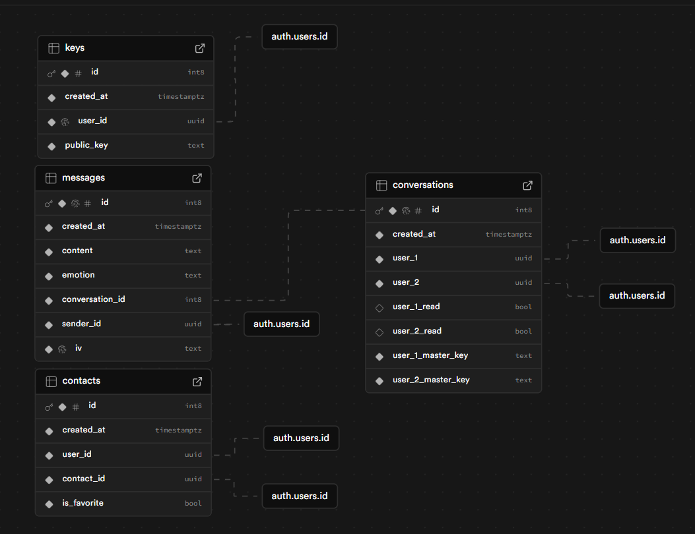
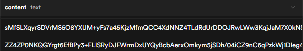

# Mental

A sentiment analysis messaging web-app

# Creating the Model

`!pip install tensorflow==2.15.0`
`!pip install tensorflow_decision_forests==1.8.1`
`!pip install tensorflowjs`

from kaggle we get:

- word_index.json dictionary
- model.json model
- group1-shard1of1.bin weights

---

## Preparing the Data

Machine learning models cant process text. so we prepare the text data for use in neural networks by converting raw text into numerical form (which machine learning models can understand)

To achieve this we use a process called word-to-idex mapping. In our case, we used the `Tokenizer` method from `tensorflow`

```python
from tensorflow.keras.preprocessing.text import Tokenizer

# Preprocess text data
tokenizer = Tokenizer(num_words=10000)
tokenizer.fit_on_texts(df['text'])
sequences = tokenizer.texts_to_sequences(df['text'])
padded_sequences = pad_sequences(sequences, maxlen=100)
```

What this does is it breaks down a string of text into smaller units (called **tokens**). These tokens can be words, subwords, or characters, depending on the level of tokenization.
The **Tokenizer** in Python typically breaks text into words. For example, the sentence "I love machine learning" would be tokenized into the list: `["I", "love", "machine", "learning"]`

After splitting the text into tokens, the Tokenizer assigns each unique token (word) a unique integer index.

```python
{
  "I": 1,
  "love": 2,
  "machine": 3,
  "learning": 4,
  "coding": 5
}
```

The Tokenizer builds a **vocabulary** based on the entire text dataset. It collects all unique words, ranks them by frequency, and assigns an index to each word.

> [!TIP]
>
> ### Why tokenize?
>
> Neural networks and other machine learning algorithms **cannot understand raw text**. They require numerical input, which is why we need to convert words into numbers. The Tokenizer provides an easy and efficient way to do this.

> [!TIP]
>
> ### Why limit to 10k words
>
> - **Text data can have an extremely large vocabulary**: In any large corpus, there can be millions of unique words (including variations, rare words, typos, etc.). If you were to use all of these words, the size of your vocabulary would grow substantially, which would make the model harder to train (more parameters, larger embeddings, etc.).
> - By setting `num_words=10000`, you limit the vocabulary to the **most common 10,000 words**. This reduces the complexity and ensures that the model focuses on the words that are most relevant or frequent in the dataset.
> - Including too many rare words can lead to overfitting, especially if the model memorizes them. By limiting the vocabulary to the most frequent words, you help ensure that the model generalizes better.

## Training the Model

## Analyzing Performance

## Exporting the Model

# Creating the Web-App

> [!NOTE]
> As of now, all backend will be handled in supabase

> [!IMPORTANT]
>
> ### Glossary
>
> - Wrapper
> - Routing
> - Element
> - View
> - React
> - Component
> - Props
> - Tag
> - Single Page Application (SPA)

> [!TIP]
>
> ### Bibliography
>
> [Vite](https://www.reddit.com/r/reactjs/comments/yuxa16/createreactapp_or_vite_for_new_project/?rdt=40058)
> It's faster and does not need ejecting
>
> [SWC](https://www.dhiwise.com/post/maximize-performance-how-swc-enhances-vite-and-react)
>
> [MUI](https://mui.com/material-ui/all-components/)
> Responsive layout both for desktop and mobile applications
>
> [React Router Dom](https://v5.reactrouter.com/web/guides/quick-start)
> For routing between views

## Routing

A well known React library is integrated to handle "page" routing, called `react-router-dom`.
This library helps define components as "pages" that the app can route to.

### 1. Wrapper

To link everything together, the app is being wrapped with the `BrowserRouter` element:

`App.jsx`

```jsx
<BrowserRouter>
  <ThemeProvider theme={darkTheme}>
           {" "}
    <Routes>
                <Route path="/" element={<Homepage />} />
                <Route path="/chat/:chatId" element={<Chat />} />
                <Route path="*" element={<NotFound />} />
    </Routes>
  </ThemeProvider>
</BrowserRouter>
```

This wrapper informs the app of the routing and helps nest all the possible routes that are available to link to.

### 2. Routes

Inside that wrapper, a series of _routes_ are being nested, representing the different "pages" a user can be linked to throughout the application.

`App.jsx`

```jsx
<Routes>
  <Route path="/" element={<Homepage />} />
  <Route path="/chat/:chatId" element={<Chat />} />
  <Route path="*" element={<NotFound />} />
</Routes>
```

Among these routes we can distill four main path types:

1. A path with a single slash `"/"` declaring the main view of the application.
2. Paths with a slash and a name `"/about"` declaring a view.
3. Paths like a view, with a colon `"/chat/:chatId"` declaring a sub-view.
4. A path with an asterisk `"*"` declaring every path that is not declared (typically for not-found views)

### 3. Links

Each element is being defined as a link component and includes the link of the view it will route to when clicked.

`Sample routing button`

```jsx
<Button component={Link} to="/home" />
```

The "component" prop will render the component as a `Link` and the "to" prop will define where it will link to when clicked.

---

## Styling

For styling, a popular component library is used called Material UI or [MUI](https://mui.com/material-ui/)

### 1. About MUI

Material UI is an open-source React component library that implements Google's Material Design. It's comprehensive and can be used in production out of the box.

The main advantage of using Material UI is a faster developing time and keeping the focus on business logic instead of styling and formatting. The library also includes an extensive set of intuitive customizability features as well as templates to speed up the development even more, however for this project no template will be used.

### 2. Component Usage

Material UI provides a plethora of pre-built components for use. Once Installed, a component can easily be used by importing it and inserting a simple tag.

Imported components can be as simple or a complex as the user needs. MUI provides the ability to customize them by adding several different props that alter them in many ways depending on the component. A list of such components can be found [here](https://mui.com/material-ui/all-components/)

`MUI button usage`

```jsx
import * as React from "react";
import Stack from "@mui/material/Stack";
import Button from "@mui/material/Button";

export default function BasicButtons() {
  return (
    <Stack spacing={2} direction="row">
      <Button variant="text">Text</Button>
      <Button variant="contained">Contained</Button>
      <Button variant="outlined">Outlined</Button>
    </Stack>
  );
}
```

`Button output`
![[{3E757C6E-36BF-482E-89F8-CB4E0A6501BC}.png]]

### 3. Custom Styles

With MUI, custom styles can be defined by passing the `sx` prop to a component. The `sx` allows working with a superset of CSS that packages all of the style functions exposed in `@mui/system`.

Any valid CSS can be specified using this prop, as well as many *theme-aware* properties that are unique to MUI System.

`Utilizing the sx prop`

```jsx
<Box
  sx={{
    bgcolor: "background.paper",
    boxShadow: 1,
    borderRadius: 2,
    p: 2,
    minWidth: 300,
  }}
/>
```

### 4. Themes and Color Palettes

With MUI, creating a theme like a dark-mode is as easy as wrapping the application and defining the color palette.

To maintain the dark aspect of the application, a dark theme is stored using MUI's `createTheme()` function and the same goes for a light theme.

`Defining the themes`

```jsx
const darkTheme = createTheme({
  palette: {
    mode: 'dark',
    ...
  },
});
```

After that, the `App.jsx` is wrapped with Material UI's `ThemeProvider` tag, with the pre-defined theme passed as a prop.

`Using the theme`

```jsx
export default function App() {
  return (
    <ThemeProvider theme={darkTheme}>
      <CssBaseline />
      <main>This app is using the dark mode</main>
    </ThemeProvider>
  );
}
```

With this method we can ensure that the application uses the default color palette for both dark and light mode.


### 5. Layout and Responsiveness

To keep the application responsive across different screens and devices, several MUI components are utilized such as `Container` and `Stack` that help set a base layout of the encapsulated components, as well as several `breakpoints` that define aspects based on the screen size.

Using a `Stack` tag can be an easy way to layout components and arrange them horizontally or vertically.

`Arranging items with a Stack`

```jsx
<Stack
  spacing={{ xs: 1, sm: 2 }}
  direction="row"
  useFlexGap
  sx={{ flexWrap: "wrap" }}
>
  <Item>Item 1</Item>
  <Item>Item 2</Item>
  <Item>Long content</Item>
</Stack>
```

`Stack output`
![[{C089DE2B-36F1-4425-A40C-B516F83CFCA6}.png]]

Breakpoints help define the different changes based on the current screen size. To make use of them, a pre-defined breakpoint can be used in the `sx` prop of the component.

`Utilizing the breakpoints`

```jsx
<Box
  sx={{
    width: {
      xs: 100, // theme.breakpoints.up('xs')
      sm: 200, // theme.breakpoints.up('sm')
      md: 300, // theme.breakpoints.up('md')
      lg: 400, // theme.breakpoints.up('lg')
      xl: 500, // theme.breakpoints.up('xl')
    },
  }}
>
  This box has a responsive width.
</Box>
```

This way we can make sure that every component has the correct layout for each screen and every bit is visible both in mobile and desktop screens.

> [!NOTE]
>
> ### Difference between breakpoints
>
> MUI's pre-defined breakpoints include:
> `xs`: screen width of `0px` - `599px` >`sm`: screen width of `600px` - `899px` >`md`: screen width of `900px` - `1199px` >`lg`: screen width of `1200px` - `1535px` >`xl`: screen width of `1536px`+

## Database

The application employs a hybrid database architecture that combines a robust backend PostgreSQL database hosted on Supabase with client-side storage implemented through the IndexedDB API. This dual-database approach supports both persistent server-side data management and secure client-side cryptographic operations.

The Supabase database follows a relational schema designed to efficiently model the relationships between users, conversations, and messages



1. **Conversations:** Represents chat sessions between two users, storing metadata and encrypted master keys
2. **Messages:** Contains all encrypted messages with their metadata, including timestamps and emotional analysis
3. **Contacts:** Maps relationships between users, including favorite status and conversation links
4. **Keys:** Contains the public cryptographic keys associated with each user

Users are stored securely within supabase's authentication system which leaves room for extra security. That ensures the safety of each user's password and is directly connected to the created tables.

## Client-side storage

To support the end-to-end encryption system, a browser-based IndexedDB database stores sensitive cryptographic material.

```js
export async function initializeIndexedDB(userId) {
  // Create the database structure
  const request = indexedDB.open("Mental_DB", 1);

  request.onupgradeneeded = (event) => {
    const db = event.target.result;

    // Create key pairs table
    const objectstore = db.createObjectStore("key_pairs", {
      keyPath: "user_id",
    });
    objectstore.createIndex("user_id", "user_id", { unique: true });
    objectstore.createIndex("public_key", "public_key", { unique: true });
    objectstore.createIndex("private_key", "private_key", { unique: true });

    // Create master keys table
    const masterObjectstore = db.createObjectStore("master_keys", {
      keyPath: "conversation_id",
    });
    masterObjectstore.createIndex("conversation_id", "conversation_id", {
      unique: true,
    });
  };
}
```

This IndexedDB instance stores:

- Private keys: The user's RSA private key, never transmitted to the server
- Master keys: Decrypted AES keys for each conversation, used for message encryption/decryption

The design prioritizes security by ensuring that sensitive cryptographic materials never leave the client device in unencrypted form, while still providing seamless data synchronization across multiple devices.

## API

The application leverages Supabase's comprehensive API ecosystem to handle data operations, authentication, and storage. This serverless architecture eliminates the need for a custom backend while providing robust security and scalability.

The API layer is organized into functional modules that encapsulate specific operations:

1. **Authentication API:** Manages user registration, login, and session management
2. **Contacts API:** Handles user discovery, relationship management, and public key exchange
3. **Conversations API:** Manages chat sessions and encrypted master key distribution
4. **Messages API:** Handles storing and retrieving encrypted messages
5. **Emotions API:** Interfaces with the machine learning model for sentiment analysis

```js
// Example of the emotion prediction API
export async function getEmotionPrediction(text) {
  if (!text) return;

  try {
    const { data, error } = await supabase.functions.invoke("predict-emotion", {
      body: { text: text },
    });

    if (error) throw error;
    return { data, error };
  } catch (error) {
    console.error("Error fetching emotion prediction:", error.message);
    throw error;
  }
}
```

The system employs Supabase's server-side PostgreSQL functions to implement complex operations securely.

```sql
begin
  -- Set is_favorite to false for all contacts of the current user
  update contacts
  set is_favorite = false
  where user_id = auth.uid();

  -- Set is_favorite to true for the selected contacts
  update contacts
  set is_favorite = true
  where user_id = auth.uid()
  and contact_id = any(favorite_contact_ids);
end;

```

These server-side functions offer several advantages:

- Reduced network traffic by processing data at the source
- Enhanced security through access control at the database level
- Improved performance for complex relational queries

After creation, these functions can be initiated by calling supabase's rpc function.

```js
export async function updateFavoriteContacts(favoriteContactIds) {
  try {
    const { data, error } = await supabase.rpc("update_favorite_contacts", {
      favorite_contact_ids: favoriteContactIds,
    });

    if (error) throw error;

    return data;
  } catch (error) {
    console.error("Error updating favorite contacts:", error.message);
    throw error;
  }
}
```

## Real-time Subscriptions

The application utilizes Supabase's real-time capabilities for instant message updates.

```js
const subscription = supabase
  .channel(`messages:conversation_id=eq.${conversationId}`)
  .on(
    "postgres_changes",
    {
      event: "*",
      schema: "public",
      table: "messages",
      filter: `conversation_id=eq.${conversationId}`,
    },
    (payload) => {
      setMessages((currentMessages) => [...currentMessages, payload.new]);
    },
  )
  .subscribe();
```

This enables a responsive user experience where new messages appear instantly without polling the server for updates.

## Hooks

The application employs a comprehensive set of custom React hooks to encapsulate and reuse complex business logic. These hooks abstract away implementation details, providing a clean interface for components to interact with the data layer and various application services.

Several hooks are implemented to manage data retrieval operations. These hooks manage the entire data lifecycle, including:

- Initial data loading states
- Asynchronous data fetching
- Error handling
- Data transformation (such as decryption)
- Real-time subscriptions when applicable

```jsx
export function useGetConversationMessages(conversationId) {
  const [messages, setMessages] = useState([]);
  const [decryptedMessages, setDecryptedMessages] = useState([]);
  const [isLoading, setIsLoading] = useState(true);
  const [error, setError] = useState(null);

  useEffect(() => {
    if (messages && messages.length > 0) {
      (async () => {
        const decryptedMessages = await decryptMessages(
          messages,
          conversationId,
        );
        setDecryptedMessages(decryptedMessages);
      })();
    }
  }, [messages]);

  // Additional logic for fetching and subscribing to messages

  return { decryptedMessages, isLoading, error };
}
```

State management hooks are also used in this instance to encapsulate complex state management operations.

```jsx
export function useMessageHandler(chatId, onColorUpdate, userId) {
  const [text, setText] = useState("");
  const [error, setError] = useState(null);

  const { fetchPrediction } = useGetEmotionPrediction();
  const { sendMessage } = useSendMessage();

  const handleSend = async () => {
    if (!text.replace(/\s/g, "")) return;

    // Message handling logic including encryption and emotion prediction

    return prediction;
  };

  // Additional utility functions

  return {
    text,
    setText,
    handleSend,
    handleKeyDown,
    error,
    dismissError,
  };
}
```

The last type of hooks that are implemented are authentication hooks. These are used to manage the authentication state and user identity.

```jsx
export function useGetUserId() {
  const [userId, setUserId] = useState(null);

  useEffect(() => {
    const getUserId = async () => {
      const {
        data: { user },
      } = await supabase.auth.getUser();
      setUserId(user?.id);
    };
    getUserId();
  }, []);

  return userId;
}
```

This pattern of custom hooks creates a clean separation of concerns, improves code reusability, and simplifies component implementation by abstracting away complex logic related to data management and API interactions.

## Host

The application is designed for modern web deployment with progressive web app (PWA) capabilities, allowing installation on mobile devices. This approach provides the advantages of both web accessibility and native-like functionality.

The deployment is managed using Vercel, a platform specialized in hosting JavaScript applications. This configuration ensures proper routing for the single-page application architecture, directing all requests to the main entry point where the React Router handles internal navigation.

## Authentication

The application implements a robust authentication system leveraging Supabase Auth, which provides secure user management with multiple authentication options. This system integrates seamlessly with the application's encryption architecture to ensure both identity verification and data security.

```jsx
<Auth
  supabaseClient={supabase}
  providers={["google", "github"]}
  socialLayout="horizontal"
  // Additional configuration
/>
```

A React context is also implemented to manage authentication state throughout the component tree.

```js
export function AuthProvider({ children }) {
  const [session, setSession] = useState(null);
  const [isLoading, setIsLoading] = useState(true);
  const [dbInitialized, setDbInitialized] = useState(false);

  useEffect(() => {
    // Initialize authentication state and listen for changes

    const {
      data: { subscription },
    } = supabase.auth.onAuthStateChange(async (_event, session) => {
      setSession(session);

      if (session) {
        // Initialize cryptographic storage when authenticated
        await initializeIndexedDB(session.user.id);
        setDbInitialized(true);
      }

      setIsLoading(false);
    });

    return () => subscription.unsubscribe();
  }, []);

  // Additional authentication methods

  return (
    <AuthContext.Provider
      value={{ session, isLoading, dbInitialized, signOut }}
    >
      {children}
    </AuthContext.Provider>
  );
}
```

Users can authenticate through multiple methods. This implementation offers:

- Email/password authentication with secure password handling
- Social login through Google and GitHub
- Session persistence across browser sessions
- Automatic token refresh for continuous authentication

# Providing Security

Secure communication is a big concern in modern messaging applications. To address this need, the system implements a robust end-to-end encryption (E2EE) protocol that ensures message confidentiality between participants. This section explores the cryptographic foundations and implementation details of the security layer.

## End-to-end encryption (E2EE)

**Asymmetric Encryption** uses a pair of mathematically related keys—public and private. The public key can be freely shared, while the private key remains secret. Any message encrypted with the public key can only be decrypted with the corresponding private key. This system facilitates secure key exchange but operates more slowly for large data volumes.

```js
// RSA-OAEP implementation for asymmetric encryption
async function generateKeyPair() {
  const { publicKey, privateKey } = await window.crypto.subtle.generateKey(
    {
      name: "RSA-OAEP",
      modulusLength: 4096,
      publicExponent: new Uint8Array([1, 0, 1]),
      hash: "SHA-256",
    },
    true,
    ["encrypt", "decrypt"],
  );

  // Keys are exported and encoded in base64 format
  // ...
}
```

**Symmetric Encryption** utilizes a single shared key for both encryption and decryption operations. While significantly faster for processing large amounts of data, the challenge lies in securely exchanging this key between parties.

```js
// AES-GCM implementation for symmetric encryption
async function generateMasterKey() {
  let key = await window.crypto.subtle.generateKey(
    {
      name: "AES-GCM",
      length: 256,
    },
    true,
    ["encrypt", "decrypt"],
  );

  return await exportMasterKey(key);
}
```

The implemented solution combines both approaches to leverage their respective advantages. The system creates a unique symmetric key (master key) for each conversation, which encrypts all messages exchanged within that conversation. This master key is then securely distributed to both participants using asymmetric encryption.

**The hybrid approach works as follows:**

1. Each user generates an RSA key pair (4096-bit) during account creation
2. For each conversation, a shared AES-256-GCM master key is generated
3. The master key is encrypted twice—once with each participant's public key
4. Both encrypted versions are stored in the database
5. Each participant can only decrypt the master key using their private key
6. All messages are encrypted/decrypted using the master key

> [!TIP]
>
> ### This architecture provides several significant benefits:
>
> - Security: Neither the server nor any third parties can access message content
> - Performance: Fast symmetric encryption for message content
> - Key Management: Secure key distribution without direct exchange

## Encrypting data

The encryption process occurs entirely client-side, ensuring that only encrypted data ever reaches the server. Each message is encrypted using the Web Crypto API with the AES-GCM algorithm. This implementation includes careful handling of encryption parameters, particularly the initialization vector (IV), which ensures that identical plaintext messages produce different ciphertexts.

```js
export async function encryptMessage(message, masterKey) {
  // Convert message to binary format
  const encodedMessage = encodeMessage(message);
  const importedKey = await importMasterKey(masterKey);

  // Generate a random initialization vector
  const iv = window.crypto.getRandomValues(new Uint8Array(12));

  // Encrypt the message
  const encryptedMessage = await window.crypto.subtle.encrypt(
    { name: "AES-GCM", iv: iv },
    importedKey,
    encodedMessage,
  );

  // Return both the encrypted message and IV
  return {
    encryptedMessage: arrayBufferToBase64(encryptedMessage),
    iv: arrayBufferToBase64(iv),
  };
}
```

For storage and transmission, all binary data is converted to Base64 encoding. This ensures compatibility with databases and network protocols while maintaining the integrity of the encrypted information.


<sup>Picture: Example of encrypted messages in the database</sup>

## Decrypting data

The decryption process mirrors encryption, retrieving the relevant master key for each conversation from secure local storage. When messages are fetched from the server, they remain encrypted until rendered in the user interface.

```js
export async function decryptMessage(message, masterKey, iv) {
  try {
    const importedKey = await importMasterKey(masterKey);
    const bufferMessage = base64ToArrayBuffer(message);
    const bufferIv = base64ToArrayBuffer(iv);

    // Decrypt using the same AES-GCM algorithm
    const decryptedMessage = await window.crypto.subtle.decrypt(
      { name: "AES-GCM", iv: bufferIv },
      importedKey,
      bufferMessage,
    );

    return decodeMessage(decryptedMessage);
  } catch (error) {
    return " ";
  }
}
```

The system efficiently handles bulk decryption operations for conversation history through promise-based parallel processing:

```js
export async function decryptMessages(messages, conversationId) {
  const masterKey = await getMasterKey(conversationId);
  const messagesCopy = JSON.parse(JSON.stringify(messages));

  await Promise.all(
    messagesCopy.map(async (message) => {
      const decryptedMessage = await decryptMessage(
        message.content,
        masterKey,
        message.iv,
      );
      message.content = decryptedMessage;
    }),
  );

  return messagesCopy;
}
```

## Caveats and limitations

Despite the robustness of the implemented encryption system, several considerations and limitations should be acknowledged:

1. Key Security: The security model depends on private keys remaining secure on client devices. If a user's device is compromised, message confidentiality cannot be guaranteed.
2. Forward Secrecy: The current implementation does not support perfect forward secrecy. A compromise of the master key potentially exposes all messages in a conversation. Future iterations could implement rotating session keys.
3. Metadata Visibility: While message content is encrypted, metadata such as sender, recipient, timestamp, and message frequency remains visible to the server.
4. Browser Limitations: The system relies on browser-based cryptography through the Web Crypto API. While standardized and secure, this approach inherits any implementation-specific limitations of the user's browser.
5. Key Recovery: The system currently lacks a robust key recovery mechanism. Loss of private keys could result in permanent inability to access encrypted conversations.

These limitations represent opportunities for future enhancements to further strengthen the security architecture while maintaining the application's usability and performance characteristics.

# Migrating to Mobile

The app can migrate to mobile by making it into a progressive web-app (PWA). To do that, a developer tool is used when navigating through chrome's developer tools while on the website and selecting Lighthouse.

### Lighthouse Tool

The lighthouse tool on google chrome's developer tools allows us to analyze the performance of the application. After auditing the site, it can determine the performance, accessibility, best practices and search engine optimization (SEO).

<sub>Image: The Lighthouse performance tab</sub>

It can also provide additional information for each of them and major flaws to fix later on.

<sub>Image: Lighthouse warning message</sub>

When the metrics reach a certain point meaning it _could_ be made into a PWA, the lighthouse lets us transform it.

### Migration Process

To migrate we need to create a JavaScript worker\*
In our case, a popular library will be used to handle all that, called ??


# Application features

The main idea is centered around helping people understand eachother and communicate better. To achieve this, the application has several features integrated within it, guiding the user into a friendly and easy to navigate experience.

## Converting feelings

With the use of a custom-made neural network and an overall utilization of artificial intelligence, the application attempts to convert each text sent into an emotionally understandable spectrum of colors.

When sending messages through the application, the message contents are analyzed in real time and attempt to classify them into twenty seven different emotions which are then matched into colors. In the chatroom interface the background changes based on the emotion predictions. When a user scrolls through the application, the colors change to match the last message visible at that moment.

>  > <sub>Image: Chat view of the application</sub>

After creating and initiating a conversation with someone, the user can see in their home screen a new background that expands and changes colors as the conversations add up and their emotions change.

## Analyzing understanding

Each conversation has their own analytics desplayed in a separate dashboard. When a user navigates to a conversation, they can select the dashboard button which redirects them to that interface. There, they can view that conversation's analytics, showing the emotions throughout the month or year and even view some statistics for each emotion separately.

>  > <sub>Image: Dashboard and chat view of the application</sub>
